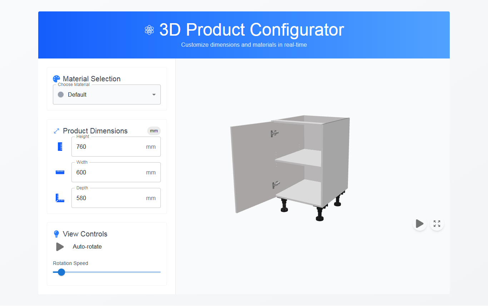

# 🚀 3D Product Configurator

 <!-- Replace with your actual screenshot -->

A beautiful, interactive 3D product customizer built with React, Three.js, and Material-UI. Allows users to visualize products with different dimensions and materials in real-time.

## Demo

Demo url: https://3d-product-iota.vercel.app/

## ✨ Features

- 🎨 **Material Selection** - Choose from multiple material presets
- 📏 **Dimension Controls** - Adjust product height, width, and depth
- 🔄 **Auto-Rotation** - Smooth automatic 3D model rotation with adjustable speed
- 🖱️ **Interactive Controls** - Orbit, zoom, and pan the 3D view
- 📱 **Fully Responsive** - Works flawlessly on desktop and mobile devices
- 🎚️ **Real-time Updates** - Changes reflect instantly in the 3D viewer

## 🛠️ Technologies Used


## 🚀 Quick Start

1. **Clone the repository**
```bash
git clone https://github.com/mrsedghi/3dProduct.git
cd 3dProduct
 ```
2. **Install dependencies**

  ```bash
    npm install
    # or
    yarn
  ```
3. **Start development server**

  ```bash
  npm run dev
  # or
  yarn dev
  ```
3. **Open in browser**
  ```bash
  http://localhost:5173/
  ```


## 🤝 Contributing

Contributions are welcome! Please follow these steps:

1. Fork the project
2. Create your feature branch (`git checkout -b feature/AmazingFeature`)
3. Commit your changes (`git commit -m 'Add some amazing feature'`)
4. Push to the branch (`git push origin feature/AmazingFeature`)
5. Open a Pull Request

## Support
If you find this project useful, consider supporting further development!

### 🌍 Iranian Support
<a href="http://www.coffeete.ir/m.r.sedghii" target="_blank">
   
</a>

### 💳 Crypto Support
**TRX (Tron) Wallet:**  
```bash
TXkEs7BHRtV6ffof79Ty92AJW1jYrFRUSY
```

<i>Your support is greatly appreciated! ❤️</i>

## 📜 License

[](https://opensource.org/licenses/MIT)

This project is licensed under the MIT License - see the [LICENSE](LICENSE) file for details.

## 📬 Contact

**MohammadReza Sedghi**

[](https://t.me/mr_sedghi)
[](mailto:m.r.sedghii@gmail.com)
[](https://github.com/mrsedghi)

**Project Link**:  
[https://github.com/mrsedghi/Samand3DViewer](https://github.com/mrsedghi/3dProduct)

## 🙏 Acknowledgments

Special thanks to these amazing projects:

[](https://threejs.org/)
[](https://github.com/pmndrs/react-three-fiber)
[](https://github.com/pmndrs/drei)
[](https://mui.com/)
[](https://vitejs.dev/)

---

<div align="center">
Made with ❤️ using Three.js and React

[](https://github.com/mrsedghi/Samand3DViewer/stargazers)
[](https://github.com/mrsedghi/Samand3DViewer/network/members)
</div>
